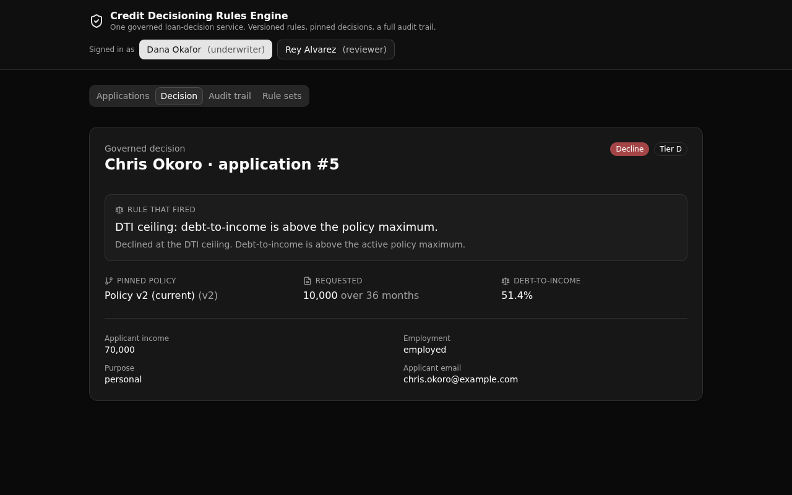

# Credit Decisioning Rules Engine

One governed loan-decision service every system calls, so credit rules live in a single versioned, auditable API layer instead of being copied into each app.

**6 tables · 8 APIs · 1 shared function.** Play 1 (Business Logic Centralization), banking and financial services. Built with [XanoTS](https://www.npmjs.com/package/@xanots/sdk): a typed Xano backend plus a React frontend that derives its paths and types from the backend defs.



## What it demonstrates

Lenders duplicate credit rules across an origination tool, a mobile app, and a partner portal, and the copies drift. This backend centralizes the rule. The credit waterfall lives in ONE function (`evaluate_application`) that both the API and the seed path call, so every consumer runs identical rules.

Three things make it a proof, not a demo:

- **Versioned policy.** Each policy is a `rule_sets` row. Exactly one is active. Every decision is pinned to the version that produced it, so a reviewer can trace an old decision to the exact rule in force at the time.
- **An append-only audit trail.** Every event on an application (submitted, evaluated) lands in `decision_log` with the actor and the policy version. Rows are never updated or deleted.
- **API-layer access control.** An underwriter may run and override decisions. A reviewer is read-only. The role is checked in each endpoint (middleware-style RBAC), never with row-level security.

## Repo layout

```
xano/
  index.ts                  the workspace, registering everything below
  tables/                   users, applicants, applications, rule_sets, decisions, decision_log
  functions/
    evaluate-application.ts  THE governed waterfall, defined once
  api/
    credit.ts                the api group (pinned canonical: credit)
    auth-login.ts            mint a bearer token
    applications-list.ts     the joined list for the screens
    applications-submit.ts   create/match applicant, compute DTI (underwriter)
    decisions-run.ts         run the waterfall, pin the decision (underwriter)
    decisions-get.ts         the decision, the rule that fired, the version
    audit.ts                 the ordered event history for an applicant
    rule-sets.ts             every policy version, active one marked
    seed.ts                  idempotent demo reset
  lib/guards.ts              the reusable underwriter role guard
frontend/
  src/lib/api.ts             the one contract: paths and types from the query defs
  src/components/screens/    Applications, Decision, Audit trail, Rule sets
```

## API surface

All endpoints live under `api:credit`. Access is enforced at the API layer.

| Verb | Path | Enforces |
| --- | --- | --- |
| POST | `auth/login` | Public. Verifies the password and mints a bearer token. |
| GET | `applications` | Signed in. Lists applications with applicant and decision. |
| POST | `applications/submit` | Underwriter only. Computes debt-to-income, opens the application. |
| POST | `decisions/run` | Underwriter only. Runs the waterfall, pins the decision to the active policy. |
| GET | `decisions/{application_id}` | Signed in. The outcome, the exact rule that fired, the policy version. |
| GET | `audit/{applicant_id}` | Signed in. The ordered event history across the applicant's applications. |
| GET | `rule-sets` | Signed in. Every policy version, the active one marked. |
| GET | `seed` | Public. Idempotent reset so the ephemeral is browsable on first open. |

The waterfall walks the active policy in order: an income floor, a requested-amount band, a debt-to-income ceiling, a referral band, then a risk tier by income. It returns approve, decline, or refer with the exact rule that fired.

## Quick start

```bash
git clone https://github.com/xano-scratch/credit-decisioning-rules-engine
cd credit-decisioning-rules-engine
npm install
npx xanots login        # authenticate with Xano (one time)
npm run xano:deploy     # builds the frontend, deploys the backend, prints a live URL
```

`xano:deploy` prints a live backend URL and a static frontend URL. The two demo accounts ship as seed data, and the frontend seeds the demo book on first open, so the app is browsable right away.

- Underwriter: `dana@lender.example` / `underwriter-demo`
- Reviewer (read-only): `rey@lender.example` / `reviewer-demo`

The signer switch in the header flips between them, so the read-only rule is visible in one click.

## FAQ

**Is this row-level security?** No. Access is checked at the API layer, in each endpoint, based on the caller's role. Xano's auth is middleware and RBAC, not row-level security.

**How do I change the credit policy?** Add a new `rule_sets` row and make it active. The waterfall reads the active version, so no code changes. Old decisions stay pinned to the version that produced them.

**Where is the decision logic?** In `xano/functions/evaluate-application.ts`. Both the run endpoint and the seed path call it, so there is one source of truth for how a decision is made.

**Can I run it without deploying?** The backend needs a Xano environment. Deploy to a free ephemeral with `npm run xano:deploy`, then open the printed frontend URL.
